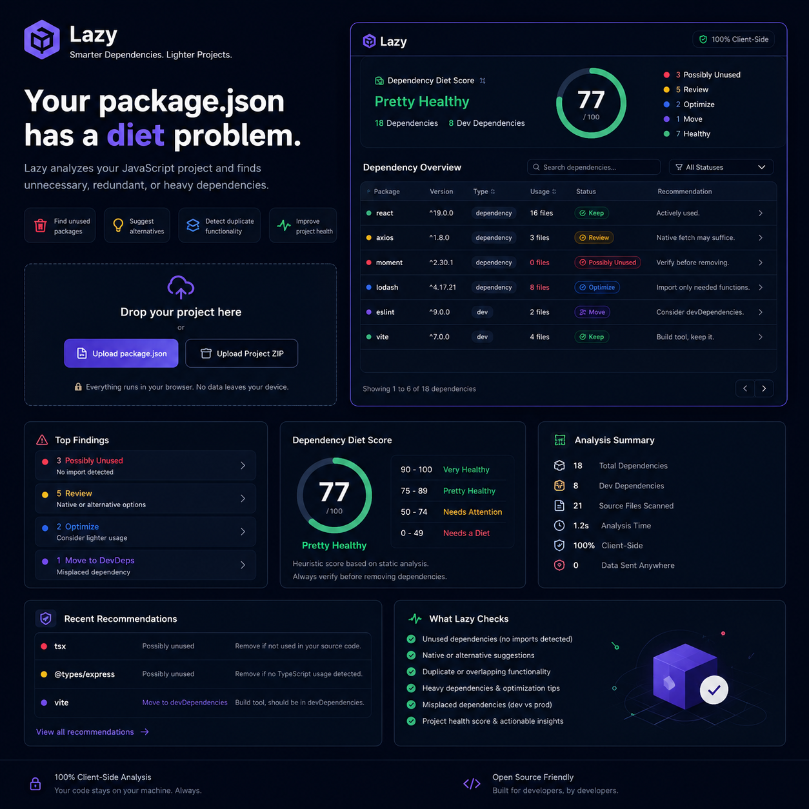

# Lazy — Dependency Diet 📦⚡

<div align="center">
  

  <p align="center">
    <strong>Smarter Dependencies. Lighter Projects.</strong><br />
    <em>Your <code>package.json</code> has a diet problem. Lazy finds unnecessary, redundant, or heavy dependencies in your JavaScript and TypeScript projects.</em>
  </p>

  <p align="center">
    
    
    
    
    
  </p>
</div>

---

## 🎯 What Lazy Does

**Lazy (Dependency Diet)** analyzes your JavaScript and TypeScript projects directly in the browser to identify bloated, misplaced, unused, or suboptimal dependencies. It scores your project's overall package health and provides actionable, drop-in replacement suggestions.

### 🌟 Key Highlights

- 🔒 **100% Client-Side & Private**: All scanning, JSON parsing, and ZIP decompilation happens inside your browser's Web Worker / memory. Zero data is sent to any server.
- 📦 **Dual Upload Modes**:
  - **`package.json` Upload**: Instant check for package classification (e.g. build tools placed in `dependencies` instead of `devDependencies`) and known lighter/native alternatives.
  - **Project ZIP Archive**: Full codebase scan across `.js`, `.jsx`, `.ts`, `.tsx`, `.mjs`, and `.cjs` files to detect exact import & `require()` statements.
- 🩺 **Dependency Diet Score (0–100)**: Instant heuristic health indicator categorized into:
  - 🟢 **90 – 100**: *Very Healthy*
  - 🟢 **75 – 89**: *Pretty Healthy*
  - 🟡 **50 – 74**: *Needs Attention*
  - 🔴 **0 – 49**: *Needs a Diet*
- 💡 **Intelligent Diet Categories**:
  - 🟢 **Keep**: Actively used and properly placed.
  - 🔴 **Possibly Unused**: No import or require statements detected in your scanned files.
  - 🟡 **Review**: Modern native or lighter alternatives exist (e.g., `axios` → Native `fetch`, `uuid` → `crypto.randomUUID`, `moment` → `date-fns`/`Intl`, `dotenv` → Node `--env-file`).
  - 🟣 **Move**: Tooling/build dependencies (e.g., `eslint`, `prettier`, `vite`, `typescript`, `@types/*`, `tsx`) misplaced in production `dependencies` instead of `devDependencies`.
  - 🔵 **Optimize**: Libraries with modular/subpath optimization suggestions (e.g., `lodash` → `lodash-es` or specific method imports).
- 🔍 **Interactive Deep-Dive Dashboard**:
  - Search by package name
  - Filter by status (`Keep`, `Review`, `Possibly Unused`, `Move`, `Optimize`) and type (`dependencies` vs `devDependencies`)
  - Click any package to inspect line-by-line file references and replacement recommendations.
- 📄 **Exportable Plain-Text Report**: One-click download of a clean `.txt` analysis report to share with your team.
- ⚡ **1-Click Demo Previews**: Instantly test the analyzer with preloaded sample projects.

---

## 🔍 What Lazy Checks

| Check Type | Description | Example |
| :--- | :--- | :--- |
| **Unused Dependencies** | Scans all project code files for `import`, `require()`, `import()`, subpaths, and scoped package references. | `moment` installed but 0 files importing it |
| **Native Alternatives** | Flags legacy libraries where modern JavaScript / Node.js provides built-in native APIs. | `axios` → Native `fetch`, `uuid` → `crypto.randomUUID()` |
| **Lighter Alternatives** | Suggests tree-shakeable, smaller bundle size replacements. | `moment` → `date-fns` / `dayjs` / native `Intl` |
| **Misplaced Dependencies** | Flags development tools, bundlers, and type definitions mistakenly placed under `dependencies`. | `vite`, `eslint`, `@types/express`, `tsx` |
| **Optimization Tips** | Detects heavy monolithic imports and suggests modular imports. | `import _ from 'lodash'` → `import debounce from 'lodash/debounce'` |

---

## 🛠️ Tech Stack

- **Framework**: [React 19](https://react.dev/)
- **Bundler**: [Vite](https://vite.dev/)
- **Styling**: [Tailwind CSS v4](https://tailwindcss.com/)
- **Icons**: [Lucide React](https://lucide.dev/)
- **Archive Extraction**: [JSZip](https://stuk.github.io/jszip/) (In-memory browser extraction)

---

## 🔒 Privacy & Security First

```
┌─────────────────────────────────────────────────────────────┐
│                      100% IN BROWSER                        │
│                                                             │
│  [ Upload ZIP / package.json ]                              │
│                │                                            │
│                ▼                                            │
│   JSZip extracts in RAM (No eval / No execution)            │
│                │                                            │
│                ▼                                            │
│   Regex AST & Import Token Scanner (Local Memory)           │
│                │                                            │
│                ▼                                            │
│   Health Score + Diet Recommendations Dashboard             │
│                                                             │
│  🛡️  Zero API calls. Zero telemetry. No data leaves device. │
└─────────────────────────────────────────────────────────────┘
```

Dependency Diet runs strictly within the client sandbox:
- **No Dynamic Code Execution**: Files are treated as static text streams.
- **Directory Filtering**: Automatically ignores `node_modules`, `.git`, `dist`, `build`, `.next`, and cache folders.
- **Offline Capable**: Works completely offline once loaded.

---

## 🚀 Getting Started

### Prerequisites

- Node.js `18.x` or higher
- `npm`, `pnpm`, or `yarn`

### Installation & Run Locally

```bash
# Clone the repository
git clone https://github.com/your-username/dependency-diet.git
cd "dependency-diet"

# Install dependencies
npm install

# Start development server
npm run dev
```

The app will be available at `http://localhost:5173`.

### Production Build

```bash
npm run build
npm run preview
```

---

## 📖 How Static Analysis Works

1. **Extraction**: Uploaded `.zip` archives are extracted in memory using JSZip.
2. **Package Manifest Parsing**: Reads all dependencies from `package.json` (`dependencies`, `devDependencies`, `peerDependencies`, `optionalDependencies`).
3. **Source Code Traversal**: Scans eligible source files (`.js`, `.jsx`, `.ts`, `.tsx`, `.mjs`, `.cjs`).
4. **Import Matcher**: Matches exact package identifiers, handles scoped modules (e.g. `@scope/pkg`), subpath imports (`pkg/subpath`), dynamic imports, and `require()` calls while avoiding substring collisions (e.g. distinguishing `react` from `react-dom` or `react-router`).
5. **Rule Scoring**: Aggregates unused count, misplaced dev dependencies, and heavy alternatives into the **Dependency Diet Score**.

---

## ⚠️ Notes & Limitations

- **Heuristic Static Analysis**: Dynamic imports computed at runtime (e.g., `import(`./locales/${lang}.json`)`) or CLI-only binaries (e.g., tools called purely from `npm scripts`) may have 0 direct file imports.
- Always run your test suite (`npm test`) and check build artifacts before removing packages marked as *Possibly Unused*.

---

## 📄 License

MIT © [Punitha K M](https://github.com/puniiith25)

